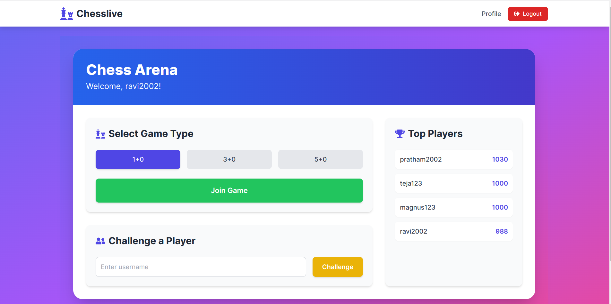
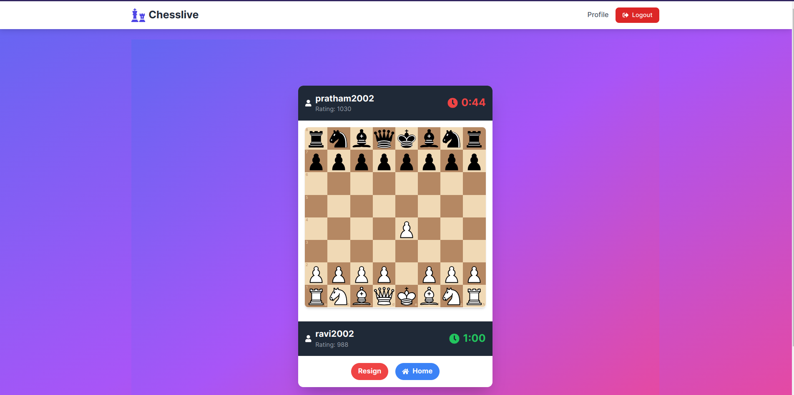
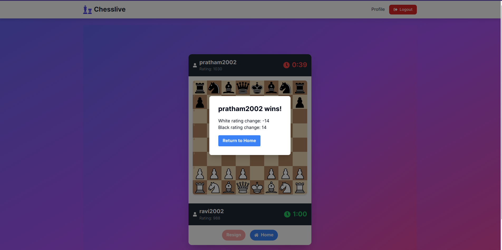
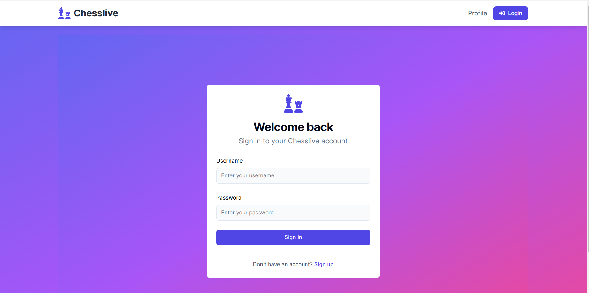
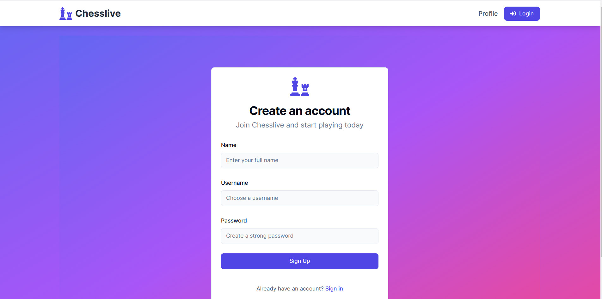

# RealtimeChess Frontend

This repository contains the frontend of RealtimeChess, a web application that allows players to play chess online with friends or random players. The frontend is built using Next.js and integrates real-time features with Socket.IO.

## Table of Contents

- [Introduction](#introduction)
- [Technologies Used](#technologies-used)
- [Features](#features)
- [Screenshots](#screenshots)
- [Installation](#installation)

## Introduction

RealtimeChess is an online chess platform where players can engage in games with friends or random opponents, track their performance through a leaderboard, and enjoy various in-game features. This repository contains the client-side code for the application, developed with Next.js.

## Technologies Used

- Next.js
- Socket.IO
- Axios

## Features

- **Play Online:** Connect with friends or random players for real-time chess matches.
- **Leaderboard:** Track top players and compare ratings.
- **Time Variants:** Choose from different time control options.
- **Rating System:** Gain or lose rating points based on match outcomes.
- **JWT Authentication:** Secure login and registration system.
- **In-Game Features:** Auto abort, resign, and automatic rejoin functionality.

## Screenshots


*Caption: Screenshot of the homepage.*


*Caption: Screenshot of the game interface.*


*Caption: Screenshot of the gameover screen.*


*Caption: Screenshot of the Login screen.*


*Caption: Screenshot of the Singup screen.*

## Installation

To set up the RealtimeChess Frontend locally, follow these steps:

1. **Clone the repository:**
   ```bash
   git clone https://github.com/PrathamSingh2002/realtime-chess-client.git
2. Navigate into the project directory:
   ```bash
   cd realtime-chess-client
3. Install dependencies:
   ```bash
   npm install
4. Set up environment variables::
   ```bash
   Create a .env.local file in the root directory.
   Define environment-specific variables like NEXT_PUBLIC_BASE_URL.
5. Start the server:
   ```bash
   npm run dev
7. The backend server should now be running on http://localhost:3000.
